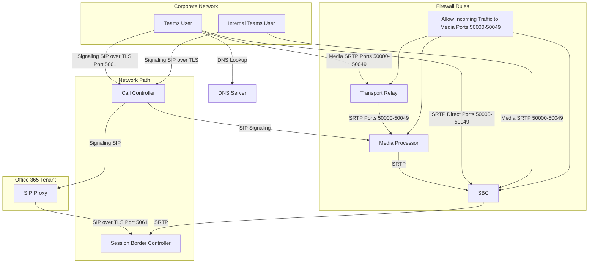

```mermaid
graph TD;
    A[Teams User] -->|Signaling SIP over TLS Port 5061| B[Call Controller]
    A -->|DNS Lookup| C[DNS Server]
    B -->|Signaling SIP| D[SIP Proxy]
    D -->|SIP over TLS Port 5061| E[Session Border Controller]

    %% External Teams User Media Flow
    A -->|Media SRTP Ports 50000-50049| F[Transport Relay]
    F -->|SRTP Ports 50000-50049| G[Media Processor]
    G -->|SRTP| H[SBC]

    %% Media Bypass
    A -->|SRTP Direct Ports 50000-50049| H[SBC]
    
    %% Internal Teams User Signaling
    I[Internal Teams User] -->|Signaling SIP over TLS| B[Call Controller]
    I -->|Media SRTP 50000-50049| H[SBC]

    %% Firewall rules
    subgraph Firewall Rules
        direction TB;
        FWL[Allow Incoming Traffic to Media Ports 50000-50049] --> H
        FWL --> G
        FWL --> F
    end

    %% Connections for different flows
    subgraph Network Path
        direction LR;
        B -->|SIP Signaling| G
        H -->|SRTP| E
    end

    %% Labeling Offices
    subgraph Office 365 Tenant
        B
        D
        F
        G
    end

    subgraph Corporate Network
        A
        I
        H
    end
```